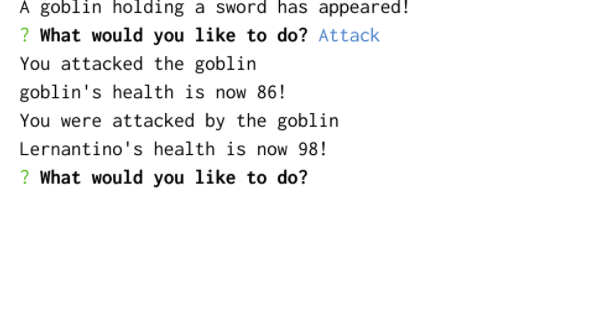

# jest-another-RPG
Module 10: OOP and TDD

## Purpose
Create a command-line role-playing game (RPG) in which the user battles a series of enemies whose health and stats can be sustained by taking a potion. 
The game will create new objects using JavaScript constructor functions.
Also implement basic code tests using the Jest framework.

## Built With
* Jest
* JavaScript
* OOP
* TDD
* Git Hub

## Contribution
Made with ❤️ by Samantha Malone
Shout out to my tutor
© 2021 Samantha Malone. All rights reserved.
